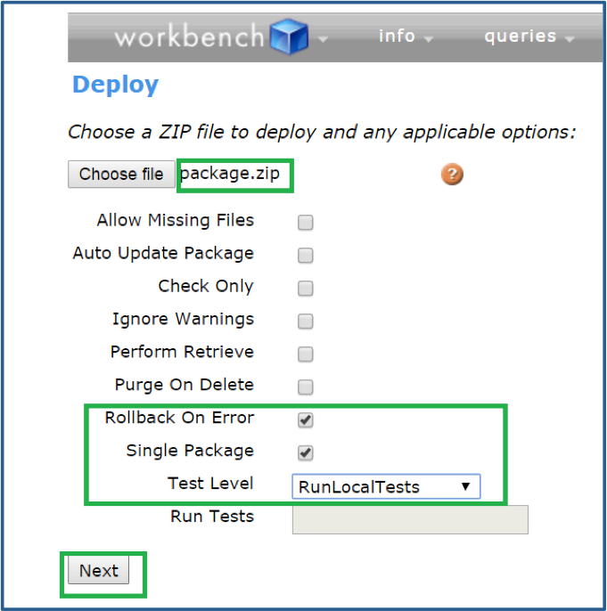

# Deleting Triggers and Apex Classes From Production

> **Attribution**: This README is derived from a SalesforceBen article: [An Easier Way to Delete Apex Classes From Production | Salesforce Ben](https://www.salesforceben.com/way-to-delete-apex-classes-from-production/)

Here's the step-by-step summary for deleting Apex classes from Salesforce Production:

1. Create a folder on desktop (e.g., 'deleteClasses')

2. Create a `package.xml` file:
   ```xml
   <!--?xml version="1.0" encoding="UTF-8"?-->
    <package xmlns="http://soap.sforce.com/2006/04/metadata">
        <version>59.0</version>
    </package>
   ``` 

3. Create a `destructiveChanges.xml` file:
   ```xml
   <?xml version="1.0" encoding="utf-8"?>
        <types>
             <members>YourClassName</members>
             <members>AnotherClassName</members>
             <name>ApexClass</name>
        </types>
   <version>30.0</version>
   </Package>
   ```
   or a trigger:
   <?xml version="1.0" encoding="utf-8"?>
        <types>
             <members>triggerName</members>
             <members></members>
             <name>Trigger</name>
        </types>
   <version>30.0</version>
   </Package>

4. Save both files.

5. Compress both XML files into a ZIP file (named 'package')

6. [Log into Workbench](https://workbench.developerforce.com/) (preferably test in Sandbox first)

7. Navigate to Migration > Deploy

8. Upload the ZIP file with these settings:
   - Check 'Rollback on Error'
   - Check 'Single Package'
   - Set Test Level to 'RunLocalTests'



9.  Click Next and wait for deployment results